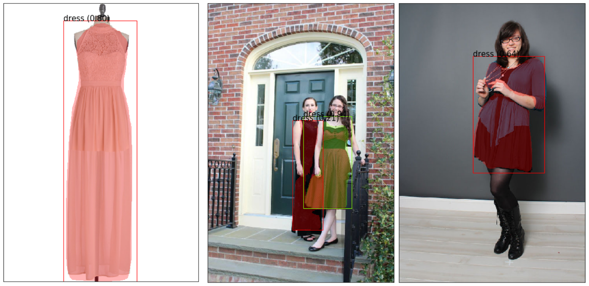
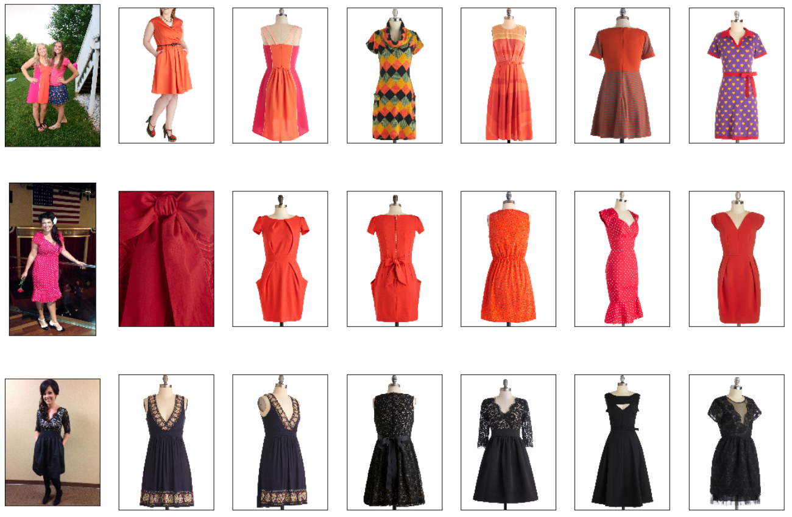

# Street2shop

Street2shop - задача сопоставления изображений одежды с уличных фото с изображениями этой же одежды в магазине. Сначала предобученный Mask R-CNN [(ovechkinVT/imaterialist)](https://github.com/ovechkinVT/imaterialist) определяет тип одежды на фото и выделяет нужную область, затем происходит поиск похожих изображений в базе данных.

Данные ([пары изображений](http://www.tamaraberg.com/street2shop/)) взяты из статьи [Hadi Kiapour, M., Han, X., Lazebnik, S., Berg, A. C., & Berg, T. L. (2015). Where to buy it: Matching street clothing photos in online shops. In Proceedings of the IEEE international conference on computer vision (pp. 3343-3351)](http://www.tamaraberg.com/papers/street2shop.pdf)

Поиск осуществлялся только на платьях.

# Пример сегментации 
Пример сегментации изображений пользовательских (2-е) и профессиональных (1 и 3) фото. Рядом с подписью типа одежды изображена уверенность сети в том, что эта часть изображения принадлежит этому типу одежды.

# Пример поиска платьев
Пример хорошего поиска платьев. Первое изображения ряда – пользовательское фото, последующие изображения – фото из магазина, подобранные нейронной сетью.

